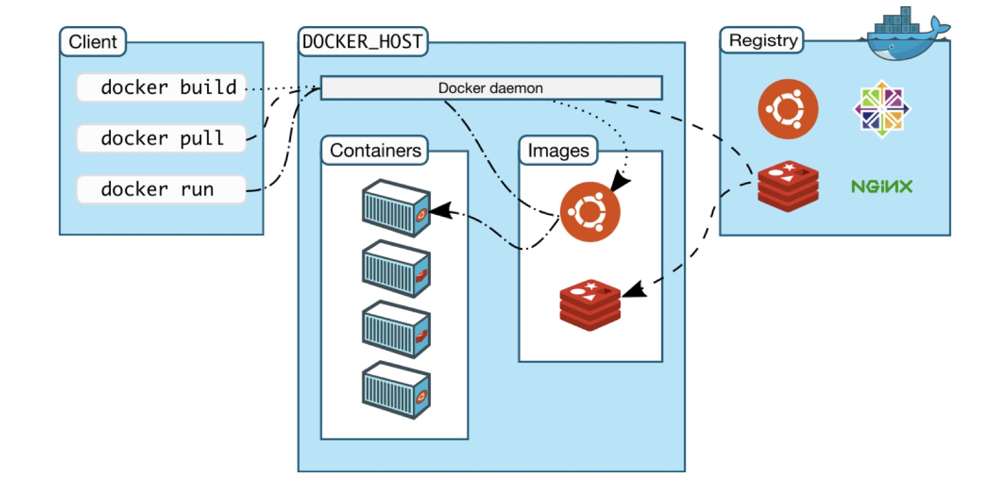
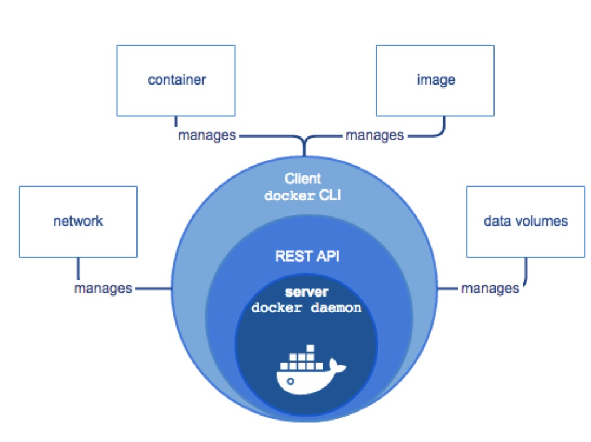
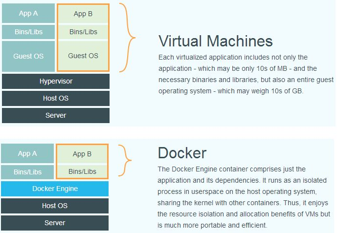

[TOC]

Docker中国：http://docker-cn.com/

Docker官网：https://www.docker.com/

Docker仓库：https://hub.docker.com/

* 该仓库在国外比较慢，可以使用阿里docker镜像

# Docker架构

Docker 体系架构

Docker 整体架构

# Docker VS VM

虚拟化技术就是虚拟了整套环境，资源占用多、启动慢

# Docker常用命令

## 帮助命令

| 命令             | 说明                       |
| ---------------- | -------------------------- |
| `docker version` | 查看版本等信息             |
| `docker info`    | 查看镜像、容器使用情况等等 |
| `docker help`    | 命令帮助                   |

## 镜像命令

| 命令            | 说明               | 参数                                                         |
| --------------- | ------------------ | ------------------------------------------------------------ |
| `docker images` | 查看镜像           | -a：列出说有镜像 -q：只显示镜像ID --digests：显示摘要信息 --no-trunc |
| `docker serach` | 搜索镜像           |                                                              |
| `docker pull`   | 从远程仓库拉取镜像 |                                                              |
| `docker rmi`    | 删除镜像           | -f：强制删除（包括在运行中的）                               |

## 容器命令

| 命令                                            | 说明                     | 参数                                                         |
| ----------------------------------------------- | ------------------------ | ------------------------------------------------------------ |
| `docker run [options] IMAGE [command][ARGS...]` | 新建容器并启动           | --name：为容器指定名称 -d：后台运行容器 -i：交互方式运行 -t：启动一个伪终端 -p：指定端口映射 -P：随机端口映射 |
| `docker ps [options]`                           | 列出容器                 | -a：列出所有的 -l：列出最近创建的 -n：列出最近N个容器 -q：只显示容器ID |
| `docker start`                                  | 启动容器                 | 容器ID/容器名称                                              |
| `docker restart`                                | 重启容器                 | 容器ID/容器名称                                              |
| `docker stop`                                   | 停止容器                 | 容器ID/容器名称                                              |
| `docker rm`                                     | 删除容器                 | 容器ID                                                       |
| `docker kill`                                   | 强制停止容器             | 容器ID/容器名称                                              |
| `docker logs -f -t --tail`                      | 查看日志                 | 容器ID                                                       |
| `docker top`                                    | 查看容器内的进程         | 容器ID                                                       |
| `docker inspect`                                | 查看容器详细信息         | 容器ID                                                       |
| `docker exec -it [id] bash`                     | 进入容器，产生新进程     |                                                              |
| `docker attach`                                 | 进入容器，不产生新进程   |                                                              |
| `docker cp`                                     | 从容器内拷贝文件到宿主机 |                                                              |

