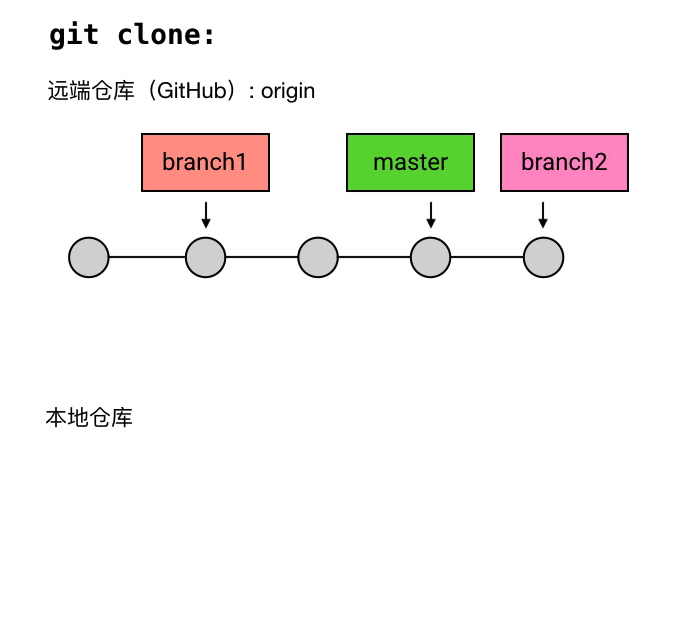

# git status
查看当前版本状态

# HEAD、master 与 branch
## HEAD
当前 commit 的引用

## master
默认 branch

>master，其实是一个特殊的 `branch`：它是 Git 的默认 `branch`

所谓的「默认 branch」，主要有两个特点：
1. 新创建的 repository（仓库）是没有任何 `commit` 的。但在它创建第一个 `commit` 时，会把 `master` 指向它，并把 `HEAD` 指向 `master`。

2. 当有人使用 `git clone` 时，除了从远程仓库把 `.git` 这个仓库目录下载到工作目录中，还会 `checkout` （签出） `master`（`checkout` 的意思就是把某个 `commit` 作为当前 `commit`，把 `HEAD` 移动过去，并把工作目录的文件内容替换成这个 `commit` 所对应的内容）。

## branch
对 commit 的引用

