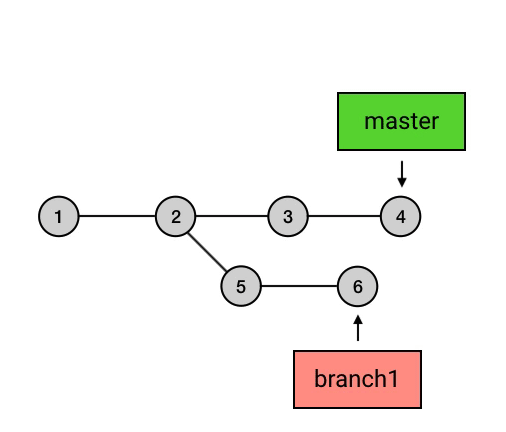
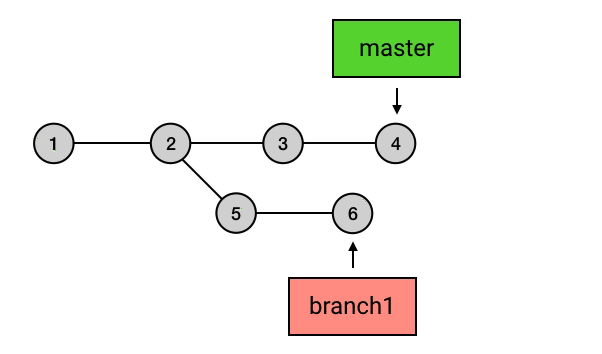
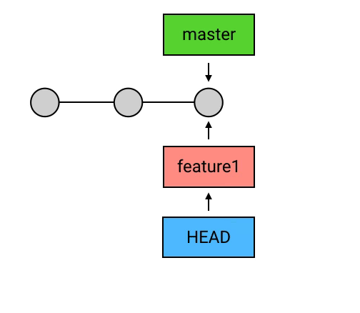
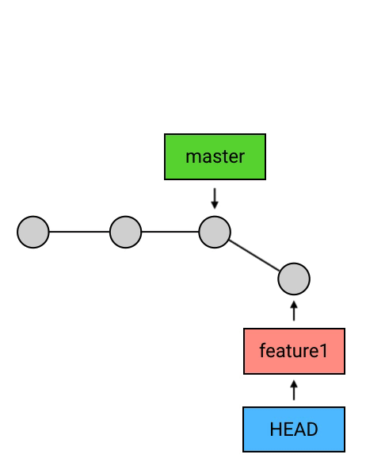
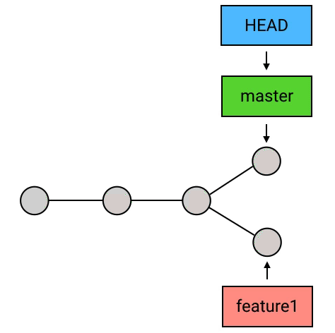
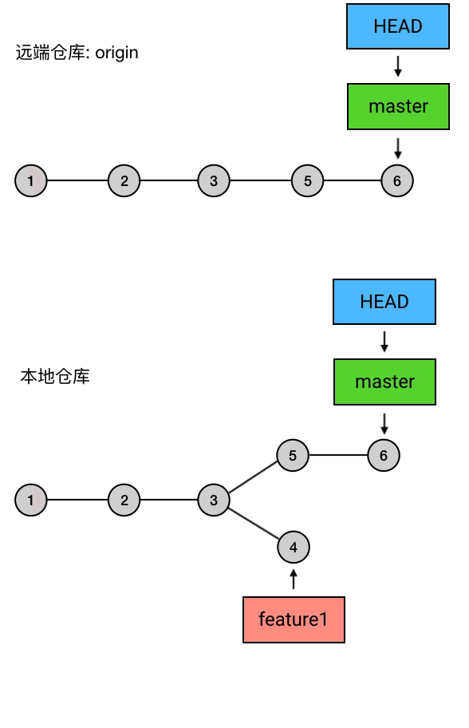

# git status

查看当前版本状态

## git 区域划分

git 分为三个区域：

1. 工作区（工作目录）
2. 暂存区（`git add` 命令会将我们做的修改添加到 `暂存区` 中 ）
3. 本地仓库区（`git commit `执行时，会提交  `暂存区` 的内容）


# HEAD、master 与 branch

## HEAD

当前 commit 的引用

## master

默认 branch

> master，其实是一个特殊的 `branch`：它是 Git 的默认 `branch`

所谓的「默认 branch」，主要有两个特点：

1. 新创建的 repository（仓库）是没有任何 `commit` 的。但在它创建第一个 `commit` 时，会把 `master` 指向它，并把 `HEAD` 指向 `master`。


1. 当有人使用 `git clone` 时，除了从远程仓库把 `.git` 这个仓库目录下载到工作目录中，还会 `checkout` （签出） `master`（`checkout` 的意思就是把某个 `commit` 作为当前 `commit`，把 `HEAD` 移动过去，并把工作目录的文件内容替换成这个 `commit` 所对应的内容）。


## branch

对 commit 的引用

引用的本质：

> 所谓「引用」（reference），其实就是一个个的字符串。这个字符串可以是一个 `commit` 的 SHA-1 码（例：`c08de9a`），也可以是一个 `branch`（例：`ref: refs/heads/xxx）。`
>
>  `Git 中的 `HEAD` 和每一个 `branch` 以及其他的引用，都是以文本文件的形式存储在本地仓库 `.git` 目录中，而 Git 在工作的时候，就是通过这些文本文件的内容来判断这些所谓的「引用」是指向谁的。

`branch` 理解为从初始 `commit` 到 `branch` 所指向的 `commit` 之间的所有 `commit`s 的一个「串」

1. 所有的 `branch` 之间都是平等的。



1. `branch` 包含了从初始 `commit` 到它的所有路径，而不是一条路径。并且，这些路径之间也是彼此平等的。



### 切换branch

```
git checkout -b feature1
....
git commit 
```



```
git checkout master
....
git commit 
```



### 删除branch

```
git branch -d feature1
```



需要说明：

1. `HEAD` 指向的 `branch` 不能删除。如果要删除 `HEAD` 指向的 `branch`，需要先用 `checkout` 把 `HEAD` 指向其他地方。

2. 由于 Git 中的 `branch` 只是一个引用，所以删除 `branch` 的操作也只会删掉这个引用，并不会删除任何的 `commit`。  

   > 不过如果一个 `commit` 不在任何一个 `branch` 的「路径」上，或者换句话说，如果没有任何一个 `branch` 可以回溯到这条 `commit`（也许可以称为野生 `commit`？），那么在一定时间后，它会被 Git 的回收机制删除掉。

3. 出于安全考虑，没有被合并到 `master` 过的 `branch` 在删除时会失败（因为怕你误删掉「未完成」的 `branch` ）

# push

实质上，`push` 做的事是：把当前 `branch` 的位置（即它指向哪个 `commit`）上传到远端仓库，并把它的路径上的 `commit`s 一并上传。


## feature1提交

```
git checkout feature1
git push origin feature1
```



# merge

合并 commits，它做的事也是合并：指定一个 `commit`，把它合并到当前的 `commit` 来

```
git merge branch1
```


`merge` 有什么用：

1. 合并分支

   > 当一个 `branch` 的开发已经完成，需要把内容合并回去时，用 `merge` 来进行合并。

2. `pull` 的内部操作

   > 之前说过，`pull` 的实际操作其实是把远端仓库的内容用 `fetch` 取下来之后，用 `merge` 来合并。