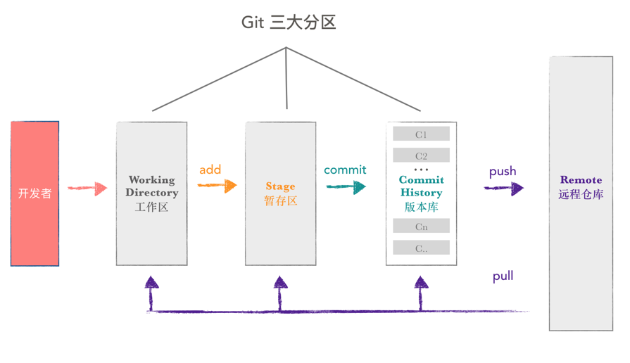

[TOC]

# git 区域划分

git 分为三个区域：

1. 工作区（工作目录）
2. 暂存区（`git add` 命令会将我们做的修改添加到 `暂存区` 中 ）
3. 本地库（`git commit `执行时，会提交  `暂存区` 的内容）

# rebase

- [官网](https://git-scm.com/docs/git-rebase)

- 相关博客
  - https://www.jianshu.com/p/4a8f4af4e803
  - https://www.liaoxuefeng.com/wiki/0013739516305929606dd18361248578c67b8067c8c017b000/0015266568413773c73cdc8b4ab4f9aa9be10ef3078be3f000

# reset 

1. `--hard`：重置位置的同时，清空工作目录的所有改动；
2. `--soft`：重置位置的同时，保留工作目录和暂存区的内容，并把重置 `HEAD` 的位置所导致的新的文件差异放进暂存区。
3. `--mixed`（默认）：重置位置的同时，保留工作目录的内容，并清空暂存区。

在 Git 中，有两个「偏移符号」： `^` 和 `~`。

- `^` 的用法：在 `commit` 的后面加一个或多个 `^` 号，可以把 `commit` 往回偏移，偏移的数量是 `^` 的数量。例如：`master^` 表示 `master` 指向的 `commit` 之前的那个 `commit`； `HEAD^^` 表示 `HEAD` 所指向的 `commit` 往前数两个 `commit`。

- `~` 的用法：在 `commit` 的后面加上 `~` 号和一个数，可以把 `commit` 往回偏移，偏移的数量是 `~` 号后面的数。例如：`HEAD~5` 表示 `HEAD` 指向的 `commit`往前数 5 个 `commit

# revert

`git revert` 撤销某次操作，此次操作之前和之后的 commit 和 history 都会保留，并且把这次撤销作为一次最新的提交

- git revert HEAD                  撤销前一次 commit
- git revert HEAD^               撤销前前一次 commit
- git revert commit （比如：fa042ce57ebbe5bb9c8db709f719cec2c58ee7ff）撤销指定的版本，撤销也会作为一次提交进行保存。

`git revert` 是提交一个新的版本，将需要 revert 的版本的内容再反向修改回去，版本会递增，不影响之前提交的内容

## git revert 和 git reset的区别 

1. `git revert` 是用一次新的 commit 来回滚之前的 commit ，`git reset` 是直接删除指定的 commit。 
2. 在回滚这一操作上看，效果差不多。但是在日后继续 merge 以前的老版本时有区别。因为 `git revert` 是用一次逆向的 commit “中和”之前的提交，因此日后合并老的 branch 时，导致这部分改变不会再次出现，但是 `git reset` 是之间把某些 commit 在某个 branch 上删除，因而和老的 branch 再次 merge 时，这些被回滚的 commit 应该还会被引入。 
3. `git reset` 是把HEAD向后移动了一下，而 `git revert` 是 HEAD 继续前进，只是新的 commit 的内容和要 revert 的内容正好相反，能够抵消要被 revert 的内容。

# stash

能够将所有未提交的修改（工作区和暂存区）保存至堆栈中，用于后续恢复当前工作目录

- git stash
- git stash list
- git stash pop
- git stash apply
- git stash clear
- git stash show
- git stash branch

参考：https://blog.csdn.net/stone_yw/article/details/80795669

# commit

## git commit --amend

- 修改最后一次commit提交信息
- 修改最后一次提交的文件
