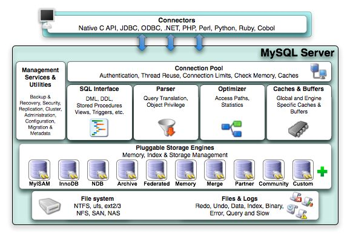

* Client Connectors
    > 接入方，支持多种协议
    
* Management Services & Utilities
    > 系统管理和控制工具，mysqldump、 mysql复制集群、分区管理等
    
* Connection Pool
    > 连接池：管理缓冲用户连接、用户名、密码、权限校验、线程处理等需要缓存的需求
    
* SQL Interface
    > SQL接口：接受用户的SQL命令，并且返回用户需要查询的结果

* Parser 
    > 解析器，SQL命令传递到解析器的时候会被解析器验证和解析。解析器是由Lex和YACC实现的
  
* Optimizer 
    > 查询优化器，SQL语句在查询之前会使用查询优化器对查询进行优化
  
* Cache和Buffer(高速缓存区) 
    > 查询缓存，如果查询缓存有命中的查询结果，查询语句就可以直接去查询缓存中取数据
    
* pluggable storage Engines
    > 插件式存储引擎。存储引擎是MySql中具体的与文件打交道的子系统
      
* file system 
    > 文件系统，数据、日志(redo，undo)、索引、错误日志、查询记录、慢查询等