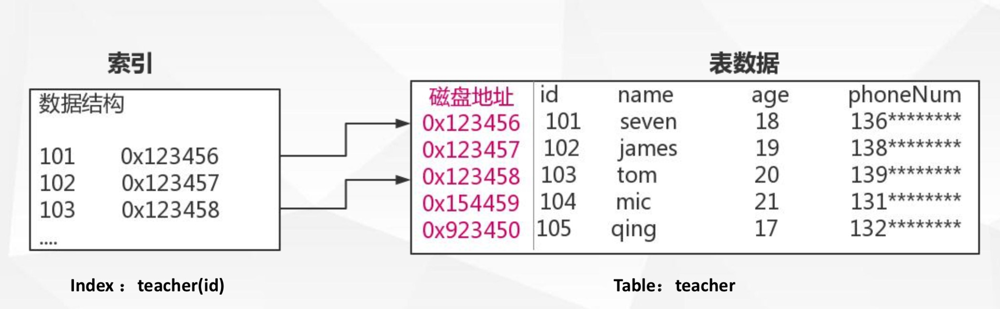
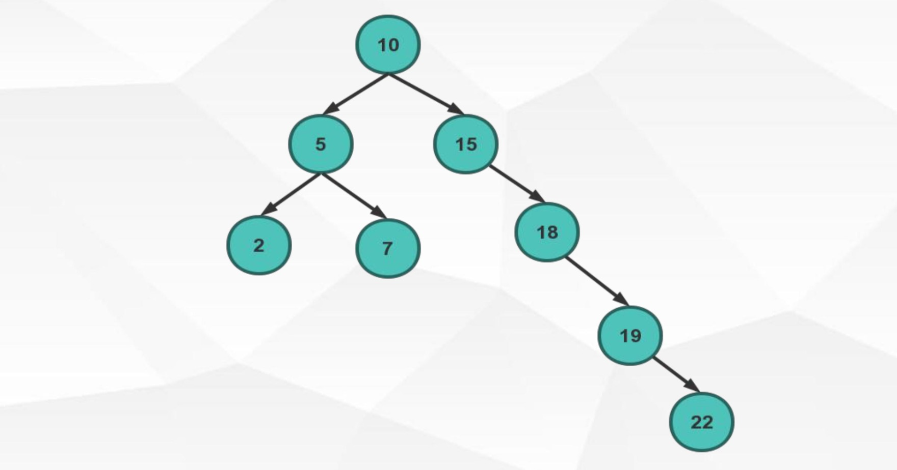
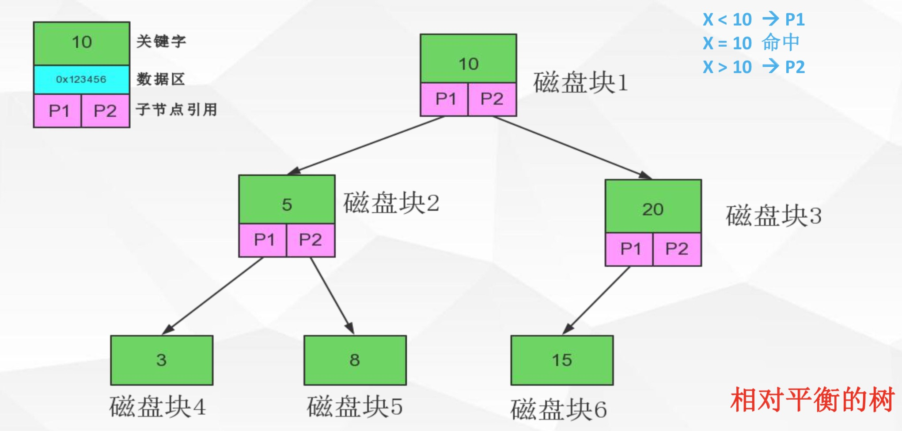
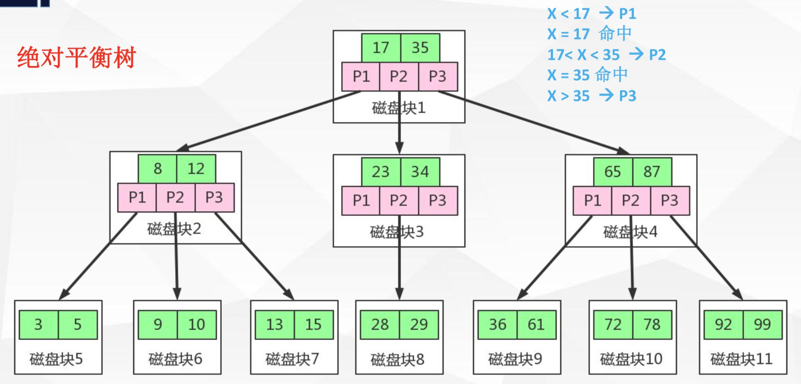
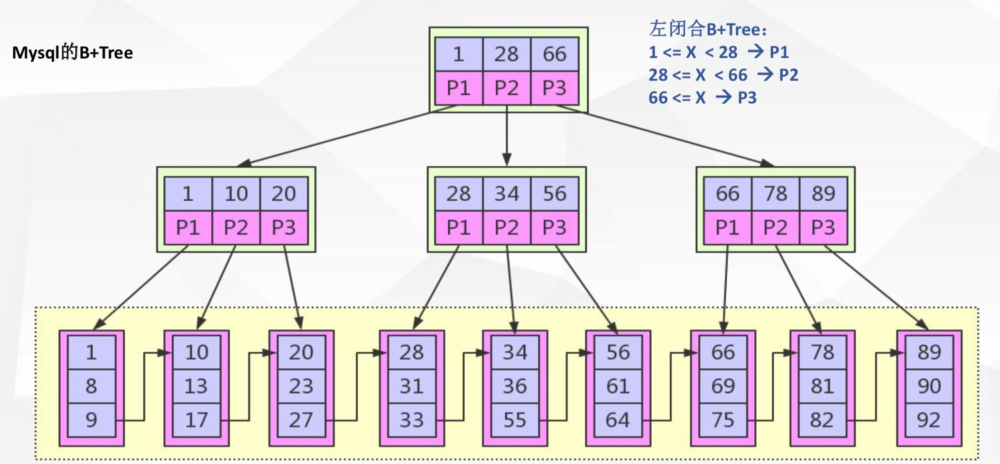
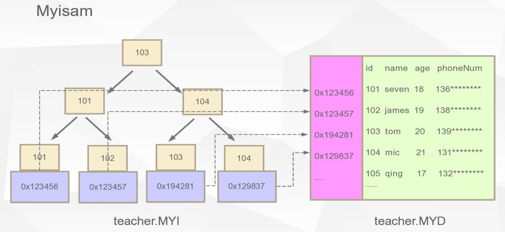
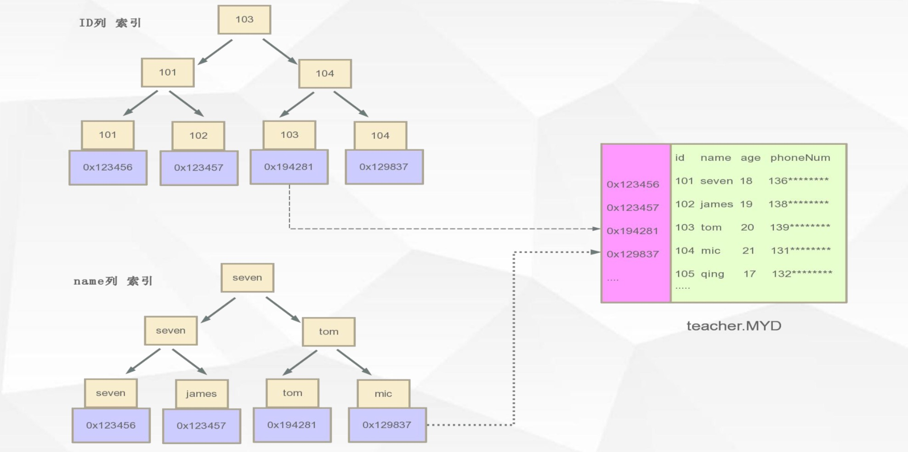
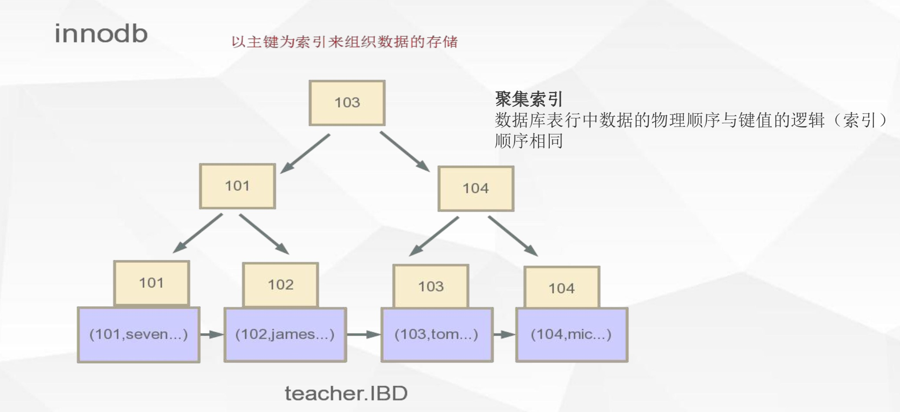
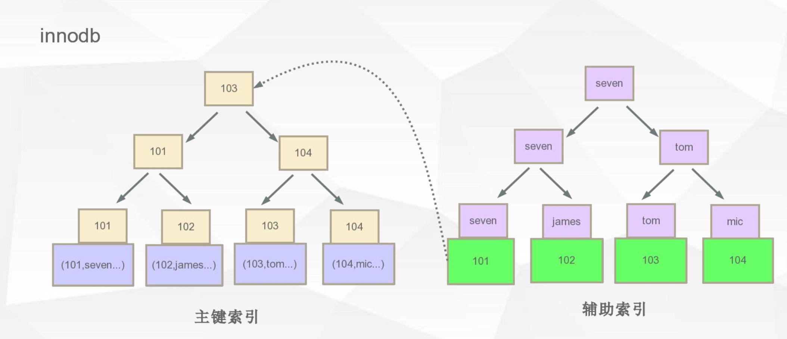

[TOC]

# 索引

## 什么是索引

索引是为了加速对表中数据行的检索而创建的一种分散存储的数据结构



## 为什么要用索引

- 索引能极大的减少存储引擎需要扫描的数据量
- 索引可以把随机IO变成顺序IO
- 索引可以帮助我们在进行分组、排序等操作时，避免使用临时表

# Mysql 为什么使用 B+Tree

## 二叉查找树



[动画演示](https://www.cs.usfca.edu/~galles/visualization/BST.html)

## 平衡二叉查找树



[动画演示](https://www.cs.usfca.edu/~galles/visualization/AVLtree.html)

缺点：

- 太深了
  - 数据处的(高)深度决定着他的IO操作次数，IO操作耗时大
- 太小了
  - 每一个磁盘块(节点/页)保存的数据量太小了
  - 没有很好的利用操作磁盘IO的数据交换特性
  - 没有利用好磁盘IO的预读能力(空间局部性原理)，从而带来频繁的IO操作

## 多路平衡查找树

[动画演示](https://www.cs.usfca.edu/~galles/visualization/BTree.html)

### B-Tree



### B+Tree



### B-Tree 和 B+Tree区别

1. B+节点关键字搜索采用闭合区间
2. B+非叶节点不保存数据相关信息，只保存关键字和子节点的引用
3. B+关键字对应的数据保存在叶子节点中
4. B+叶子节点是顺序排列的，并且相邻节点具有顺序引用的关系

### 为什么选用 B+Tree

- B+树是B-树的变种(PLUS版)多路绝对平衡查找树，他拥有B-树的优势
- B+树扫库、表能力更强
- B+树的磁盘读写能力更强
- B+树的排序能力更强
- B+树的查询效率更加稳定

# Mysql B+Tree 索引体现

## Myisam Engine



在 Myisam 引擎中，数据库对应的表会有这么几个文件

```
-rw-rw---- 1 mysql mysql  8556 12月 18 16:30 table01.frm
-rw-rw---- 1 mysql mysql     0 12月 18 16:30 table01.MYD
-rw-rw---- 1 mysql mysql  1024 12月 18 16:30 table01.MYI
```

- `.MYD` 文件存储的是具体的数据内容

- `.MYI` 文件存储的是索引树



如上图，在 Myisam 引擎中，索引指向的是数据的地址

## Innodb Engine



```
-rw-rw---- 1 mysql mysql  8586 12月  6 18:56 sys_user01.frm
-rw-rw---- 1 mysql mysql 98304 12月  6 18:56 sys_user01.ibd
```

在 Innodb 引擎中，只有 `.ibd` 文件

Innodb 引擎中，它是以主键为索引来组织数据的存储（没有指定主键，它会隐式创建），它的叶子节点存储的是具体的数据



它分为主键索引（聚集索引）和辅助索引（非聚集索引）：

- 主键索引叶子节点存储具体的数据
- 辅助索引叶子节点存储主键值

当辅助索引获取到主键值后，再通过主键索引查找到具体的数据

这里会有2个问题：

1. 为什么辅助索引叶子节点不存储主键索引数据的引用呢？

   > 当数据的引用发生变化时，需要更新所有辅助索引的数据引用

2. 为什么需要主键索引，且都是通过主键索引去查数据

   > 这和 Innodb 的设计初衷有关，它认为主键是最常用的查询条件

# 索引知识补充

## 列的离散性

离散性表示数据重复率

在建索引的时候，离散性越高，选择性就越好，命中索引的概率也就越高

## 最左匹配原则

对索引中关键字进行计算(对比)，一定是从左往右依次进行，且不可跳过

比如说，在我们建标时，会有一个排序规则，通过会设置成 `utf8_general_ci`，这会把数据转成 ASCII 码：

```
abc -> 97 98 99
adc -> 97 100 99
```

## 联合索引

- 单列索引 节点中关键字[name]
- 联合索引 节点中关键字[name,phoneNum]

单列索引是特殊的联合索引

联合索引列选择原则：

1. 经常用的列优先 【最左匹配原则】
2. 选择性(离散度)高的列优先【离散度高原则】
3. 宽度小的列优先【最少空间原则】

### 例子

如下是最常用的sql：

```
select * from users where name = ?;
select * from users where name = ? and phoneNum = ?;
```

解决方案，在 name 和 phoneNum 上都建索引：

```
create index idx_name on users(name);
create index idx_name_phoneNum on users(name,phoneNum);
```

问题在哪？

> 根据最左匹配原则，这两个sql都可以命中第二个索引，所以第一个索引是冗余的

## 覆盖索引

如果查询列可通过索引节点中的关键字直接返回，则该索引称之为覆盖索引，覆盖索引可减少数据库IO，将随机IO变为顺序IO，可提高查询性能

比如我建了下面这个索引：

```
create index idx_name_phoneNum on users(name,phoneNum);
```

当我们这么查时：

```
select name,phoneNum from users where name = ?;
```

上面的sql只查询 name 和 phoneNum，当命中索引时，不需要到叶子节点获取数据，直接在中间节点就可以把数据直接返回，这就是覆盖索引

# 总结

- 索引列的数据长度能少则少
- 索引一定不是越多越好，越全越好，一定是建合适的
- 匹配列前缀可用到索引 like 9999%（不一定，要看离散性），like %9999%、like %9999用不到索引
- Where 条件中 not in 和 <>操作无法使用索引
- 匹配范围值，order by 也可用到索引
- 多用指定列查询，只返回自己想到的数据列，少用select *
- 联合索引中如果不是按照索引最左列开始查找，无法使用索引
- 联合索引中精确匹配最左前列并范围匹配另外一列可以用到索引
- 联合索引中如果查询中有某个列的范围查询，则其右边的所有列都无法使用索引;
