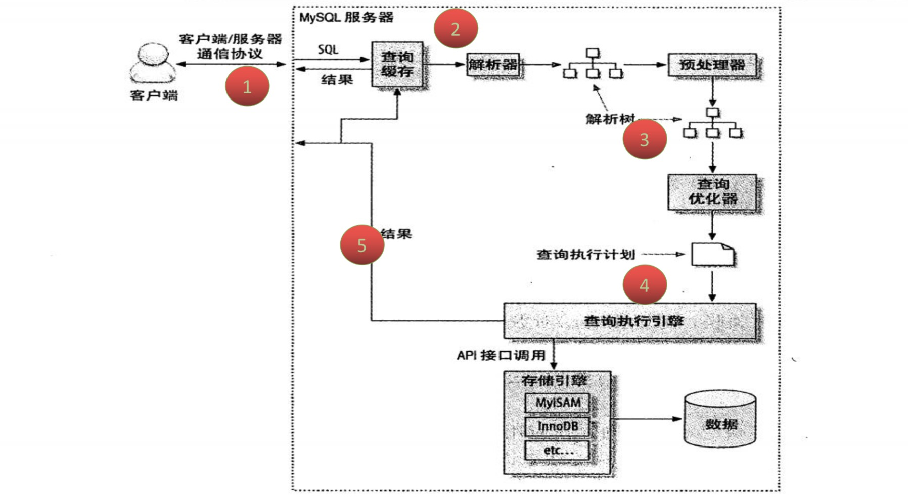

[TOC]

# Mysql 查询执行路径



1. Mysql 客户端/服务端通信](#Mysql 客户端/服务端通信)
2. 查询缓存
3. 查询优化处理
4. 查询执行引擎
5. 返回客户端

# 详解

## Mysql 客户端/服务端通信

Mysql客户端与服务端的通信方式是“半双工”

* 全双工：双向通信，发送同时也可以接收 
* 半双工：双向通信，同时只能接收或者是发送，无法同时做操作 
* 单工：只能单一方向传送 

> 半双工通信：在任何一个时刻，要么是有服务器向客户端发送数据，要么是客户端向服务端发送数据，这两个动作不能同时发生。所以我们无法也无需将一个消息切成小块进行传输 

特点和限制：客户端一旦开始发送消息，另一端要接收完整个消息才能响应。 客户端一旦开始接收数据没法停下来发送指令。 

### 通信查询状态

对于一个mysql连接，或者说一个线程，时刻都有一个状态来标识这个连接正在做什么

官方状态全集：https://dev.mysql.com/doc/refman/5.7/en/general-thread-states.html

我们可以通过以下命令查看：

```
show full processlist;
show processlist;
```

执行结果：

```
mysql> show processlist;
+------+------+-----------+------+---------+------+-------+------------------+
| Id   | User | Host      | db   | Command | Time | State | Info             |
+------+------+-----------+------+---------+------+-------+------------------+
| 9543 | root | localhost | NULL | Query   |    0 | init  | show processlist |
+------+------+-----------+------+---------+------+-------+------------------+
1 row in set (0.00 sec)
```

整理常见的状态：

| 状态           | 说明                       |
| -------------- | -------------------------- |
| Sleep          | 线程正在等待客户端发送数据 |
| Query          | 连接形成正在执行查询       |
| Locked         | 线程正在等待表锁的释放     |
| Sorting result | 线程正在对结果进行排序     |
| Sending data   | 向请求端发送数据           |

可以通过 `kill {id}` 的方式进行杀除连接

## 查询缓存

工作原理：

* 缓存 SELECT 操作的结果集和SQL语句
* 新的 SELECT 语句，先去查询缓存，判断是否存在可用的记录集

判断标准：

* 与缓存的SQL语句是否完全一样（区分大小写）

### 查看缓存设置

通过 `show variables like 'query_cache%';` 命令查询：

```
mysql> show variables like 'query_cache%';
+------------------------------+---------+
| Variable_name                | Value   |
+------------------------------+---------+
| query_cache_limit            | 1048576 |
| query_cache_min_res_unit     | 4096    |
| query_cache_size             | 1048576 |
| query_cache_type             | OFF     |
| query_cache_wlock_invalidate | OFF     |
+------------------------------+---------+
5 rows in set (0.00 sec)
```

#### query_cache_type

* 0：不启用查询缓存，默认值
* 1：启用查询缓存，只要符合查询缓存要求，客户端的查询语句和记录集都可以缓存起来（加上 `SQL_NO_CACHE` 将不缓存）
* 2：启用查询缓存，只要查询语句中添加参数 `SQL_CACHE` ，且符合查询缓存的要求，客户端的查询语句和记录集都可以缓存起来

#### query_cache_size

总的缓存池的大小，允许设置最小值为 40K，默认 1M，推荐设置为 ：32M、64M、128M

超过该大小，会将之前的缓存失效

#### query_cache_limit

限制单次查询，缓存区最大能缓存的查询记录集，默认设置为 1M

### 查看缓存情况

可以通过 `show status like 'Qcache%';`：

```
mysql> show status like 'Qcache%';
+-------------------------+---------+
| Variable_name           | Value   |
+-------------------------+---------+
| Qcache_free_blocks      | 1       |
| Qcache_free_memory      | 1031352 |
| Qcache_hits             | 0       |
| Qcache_inserts          | 0       |
| Qcache_lowmem_prunes    | 0       |
| Qcache_not_cached       | 150     |
| Qcache_queries_in_cache | 0       |
| Qcache_total_blocks     | 1       |
+-------------------------+---------+
8 rows in set (0.00 sec)
```

### 不会缓存的情况

1. 当查询语句中有一些不确定的数据时，则不会被缓存

   > 如包含函数 `NOW()` 、`CURRENT_DATE()` 等类似的函数，或者用户自定义的函数，存储函数，用户变量等都不会被缓存

2. 当查询的结构大于 `query_cache_limit` 设置的值时

3. 对于 InnoDB 引擎来说，当一个语句在事务中修改了某个表，那么在这个事务提交之后，所有与这个表相关的查询都无法被缓存

   > update table set name='hello' where id=3;

4. 查询的表是系统表

5. 查询语句不涉及到表

   > select 1;

### 为什么Mysql默认关闭了缓存

1. 在查询之前必须先检查是否命中缓存，浪费计算资源
2. 如果这个查询可以缓存，那么执行完成后，Mysql发现查询缓存中没有这个查询，则会将结构存入查询缓存，带来额外的系统消耗
3. 针对表进行写入或更新操作时，将对应表的所有缓存都设置失效
4. 如果查询缓存很大或者碎片很多时，这个操作可能带来很大的系统消耗

适用场景：

* 以读为主的业务，数据生成之后就不常改变的业务

## 查询优化处理

查询优化处理的三个阶段：

1. 解析sql

   > 通过lex词法分析，yacc语法分析将sql语句解析成解析树（[Yacc 与 Lex语法教程](https://www.ibm.com/developerworks/cn/linux/sdk/lex/)）

2. 预处理阶段

   > 根据mysql的语法的规则进一步检查解析树的合法性，如：检查数据的表和列是否存在，解析名字和别名的设置。还会进行权限的验证

3. 查询优化器

   > 优化器的主要作用就是找到最优的执行计划

解析sql和预处理阶段主要是解析和校验的一个过程，我们重点来讲下查询优化器

### 查询优化器

#### 如何找到最优执行计划

Mysql的查询优化器是基于成本计算的原则。他会尝试各种执行计划。 数据抽样的方式进行试验（随机的读取一个4K的数据块进行分析）

* 使用等价变化规则 
  * 5=5 and a>5 改写成 a>5
  * a<b and a=5 改写成 b>5 and a=5
  * 基于联合索引，调整条件位置
  * ...
* 优化count 、min、max等函数
  * min函数只需找索引最左边 ，max函数只需要索引最右边
  * myisam引擎 count(*)  无需遍历全表
* 覆盖索引扫描 
* 子查询优化
* 提前终止查询 
  * 用了limit关键字或者使用不存在的条件 
* IN的优化 
  * 先进性排序，再采用二分查找的方式（所以尽量使用 `in` ，而少用 `or` ）

#### 执行计划

使用 `EXPLAIN` ：

```
mysql> explain select * from table01 \G
*************************** 1. row ***************************
           id: 1
  select_type: SIMPLE
        table: table01
         type: system
possible_keys: NULL
          key: NULL
      key_len: NULL
          ref: NULL
         rows: 0
        Extra: const row not found
1 row in set (0.00 sec)
```

##### id

select查询的序列号，标识执行的顺序 

1. id相同，执行顺序由上至下 
2. id不同，如果是子查询，id的序号会递增，id值越大优先级越高，越先被执行 
3. id相同又不同即两种情况同时存在，id如果相同，可以认为是一组，从上往下顺序执行；在所有组中，id值越大，优先级越高，越先执行 

##### select_type

查询的类型，主要是用于区分普通查询、联合查询、子查询等

* SIMPLE：简单的 select 查询，查询中不包含子查询或者 union 
* PRIMARY：查询中包含子部分，最外层查询则被标记为 primary 
* SUBQUERY/MATERIALIZED：SUBQUERY 表示在 select 或 where 列表中包含了子查询，MATERIALIZED 表示 where 后面 in 条件的子查询 
* UNION：若第二个 select 出现在 union 之后，则被标记为 union
* UNION RESULT：从union表获取结果的select 

##### table

查询涉及到的表

* 直接显示表名或者表的别名
* <unionM,N> 由ID为M,N 查询 union 产生的结果
* <subqueryN> 由ID为N查询生产的结果

##### type

访问类型，sql查询优化中一个很重要的指标，结果值从好到坏依次是：

```
system > const > eq_ref > ref > range > index > ALL
```

* system：表只有一行记录（等于系统表），const 类型的特例，基本不会出现，可以忽略不计 
* const：表示通过索引一次就找到了，const 用于比较 primary key 或者 unique 索引 
* eq_ref：唯一索引扫描，对于每个索引键，表中只有一条记录与之匹配。常见于主键 或 唯一索引扫描 
* ref：非唯一性索引扫描，返回匹配某个单独值的所有行，本质是也是一种索引访问 
* range：只检索给定范围的行，使用一个索引来选择行 
* index：Full Index Scan，索引全表扫描，把索引从头到尾扫一遍 
* ALL：Full Table Scan，遍历全表以找到匹配的行 

##### possible_keys

查询过程中有可能用到的索引

##### key

实际使用的索引，如果为NULL，则没有使用索引

##### rows

根据表统计信息或者索引选用情况，大致估算出找到所需的记录所需要读取的行数

##### filtered

它指返回结果的行占需要读到的行（rows列的值）的百分比

表示返回结果的行数占需读取行数的百分比，filtered的值越大越好

##### Extra

十分重要的额外信息

1. Using filesort：mysql对数据使用一个外部的文件内容进行了排序，而不是按照表内的索引进行排序读取 

2. Using temporary：使用临时表保存中间结果，也就是说mysql在对查询结果排序时使用了临时表，常见于order by 或 group by 

3. Using index：表示相应的select操作中使用了覆盖索引（Covering Index），避免了访问表的数据行，效率高 

4. Using where：使用了where过滤条件 
5. select tables optimized away：基于索引优化MIN/MAX操作或者MyISAM存储引擎优化COUNT(*)操作，不必等到执行阶段在进行计算，查询执行计划生成的阶段即可完成优化 

## 查询执行引擎

调用插件式的存储引擎的原子API的功能进行执行计划的执行

## 返回客户端

1. 有需要做缓存的，执行缓存操作

2. 增量的返回结果：开始生成第一条结果时，mysql就开始往请求方逐步返回数据 

   > 好处：mysql服务器无须保存过多的数据，浪费内存。用户体验好，马上就拿到了数据