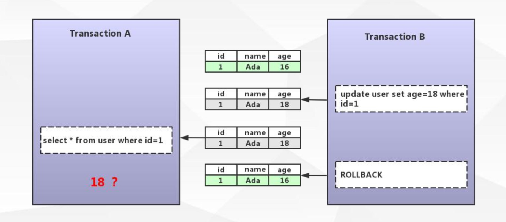
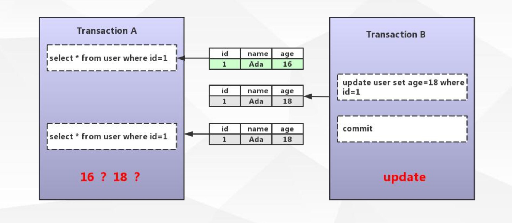
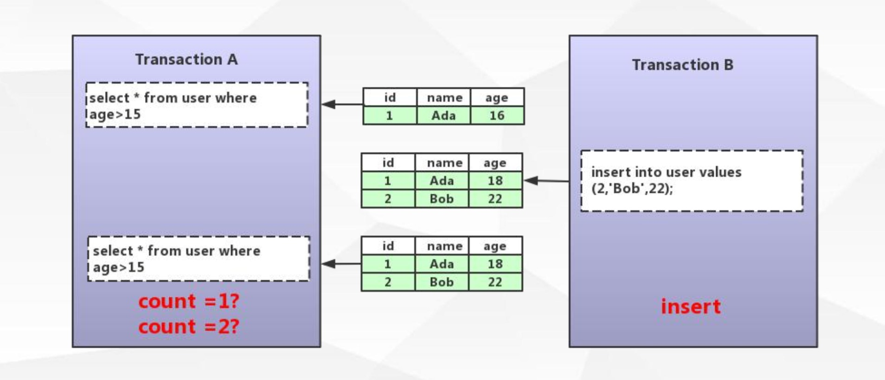

[TOC]

# 事务

数据库操作的最小工作单元，是作为单个逻辑工作单元执行的一系列操作，事务是一组不可再分割的操作集合（工作逻辑单元）

mysql中如何开启事务：

```
begin / start transaction			-- 手工
commit / rollback					-- 事务提交或回滚
set session autocommit = on/off;	-- 设定事务是否自动开启
```

## 事务ACID特性

* 原子性（Atomicity）

  > 最小的工作单元，整个工作单元要么一起提交成功，要么全部失败回滚

* 一致性（Consistency） 

  > 事务中操作的数据及状态改变是一致的，即写入资料的结果必须完全符合预设的规则，不会因为出现系统意外等原因导致状态的不一致

* 隔离性（Isolation） 

  > 一个事务所操作的数据在提交之前，对其他事务的可见性设定（一般设定为不可见）

* 持久性（Durability）

  > 事务所做的修改就会永久保存，不会因为系统意外导致数据的丢失

## 事务并发带来的问题

脏读：



不可重复读：



幻读：



## 事务隔离级别

SQL92 ANSI/ISO标准：http://www.contrib.andrew.cmu.edu/~shadow/sql/sql1992.txt

| 隔离级别                     | 解决问题       | 说明                                                         |
| ---------------------------- | -------------- | ------------------------------------------------------------ |
| Read Uncommitted（未提交读） | 未解决并发问题 | 事务未提交对其他事务也是可见的，产生脏读                     |
| Read Committed（提交读）     | 脏读           | 一个事务开始之后，只能看到自己提交的事务所做的修改，产生不可重复读 |
| Repeatable Read（可重复读）  | 不可重复读     | 在同一个事务中多次读取同样的数据结果是一样的，这种隔离级别未定义解决幻读的问题 |
| Serializable（串行化）       | ALL            | 最高的隔离级别，通过强制事务的串行执行                       |

### InnoDB对事物隔离级别的支持

| 隔离级别                     | 脏读   | 不可重复读 | 幻读               |
| ---------------------------- | ------ | ---------- | ------------------ |
| Read Uncommitted（未提交读） | 可能   | 可能       | 可能               |
| Read Committed（提交读）     | 不可能 | 可能       | 可能               |
| Repeatable Read（可重复读）  | 不可能 | 不可能     | **对InnoDB不可能** |
| Serializable（串行化）       | 不可能 | 不可能     | 不可能             |

在 InnoDB 引擎中，默认隔离级别是Repeatable Read（可重复读），也可以防止幻读

隔离级别到底是如何实现的？

# 锁

## 表锁和行锁

锁是用于管理不同事务对共享资源的并发访问

表锁与行锁的区别: 

* 锁定粒度：表锁 > 行锁
* 加锁效率：表锁 > 行锁
* 冲突概率：表锁 > 行锁
* 并发性能：表锁 < 行锁

InnoDB 存储引擎支持行锁和表锁（表锁是通过行锁实现的）

## InnoDB 锁类型

锁类型：

* 共享锁（行锁）：Shared Locks
* 排它锁（行锁）：Exclusive Locks
* 意向共享锁（表锁）：IntentionShared Locks 
* 意向排它锁（表锁）：Intention Exclusive Locks
* 自增锁：AUTO-INC Locks

行锁的算法：

* 记录锁 Record Locks
* 间隙锁 Gap Locks
* 临键锁 Next-key Locks 

### 共享锁与排他锁

#### 共享锁

又称为读锁，简称 `S锁` ，顾名思义，共享锁就是多个事务对于同一数据可以共享一把锁，都能访问到数据，但是只能读不能修改

加锁释锁方式：

```
select * from users WHERE id=1 LOCK IN SHARE MODE; 
commit/rollback;
```

举个例子：

```
### session1 ###
begin;
select * from sys_user where id=1 lock in share mode;	# 获取S锁
commit;

### session2 ###
select * from sys_user where id=1;			# 可以正常执行
update sys_user set name='k2' where id=1;	# 当上面没有commit，该语句将被阻塞
```

#### 排他锁

又称为写锁，简称 `X锁` ，排他锁不能与其他锁并存，如一个事务获取了一个数据行的排他锁，其他事务就不能再获取该行的锁（共享锁、排他锁），只有该获取了排他锁的事务是可以对数据行进行读取和修改，（其他事务要读取数据可来自于快照）

加锁释锁方式：

```
delete / update / insert 默认加上X锁
SELECT * FROM table_name WHERE ... FOR UPDATE;
commit/rollback;
```

例子：

```
### session1 ###
begin;
update sys_user set name='k3' where id=1;	# 自动获取X锁
commit;

### session2 ###
select * from sys_user where id=1 for update;			# 等待上面commit
select * from sys_user where id=1 lock in share mode;	# 等待上面commit
select * from sys_user where id=1;						# 没影响
```

#### 那么 InnoDB 行锁到底锁了什么？

InnoDB的行锁是通过给索引上的索引项加锁来实现的

**只有通过索引条件进行数据检索，InnoDB才使用行级锁，否则，InnoDB 将使用表锁（锁住索引的所有记录）**

所以在执行 delete / update / insert 时，也需要考虑索引，因为没有命中索引会变成表锁

表锁：

```
lock tables xx read/write; 
```

### 意向共享锁与意向排它锁

* 意向共享锁（IS）

  表示事务准备给数据行加入共享锁，即一个数据行加共享锁前必须先取得该表的IS锁

* 意向排它锁（IX） 

  表示事务准备给数据行加入排他锁，即一个数据行加排他锁前必须先取得该表的IX锁

简单来说，这两种锁就是一个标志位，在拿锁之前，先要判断IS/IX

意向锁（IS、IX）是 InnoDB 数据操作之前自动加的，不需要用户干预 

当事务想去进行锁表时，可以先判断意向锁是否存在，存在时则可快速返回该表不能启用表锁 

### 自增锁

针对自增列自增长的一个特殊的表级别锁

```
show variables like 'innodb_autoinc_lock_mode'; 
```

默认取值1，代表连续，事务未提交ID永久丢失

