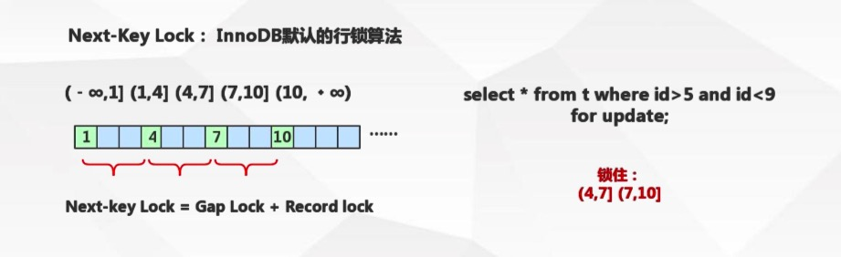
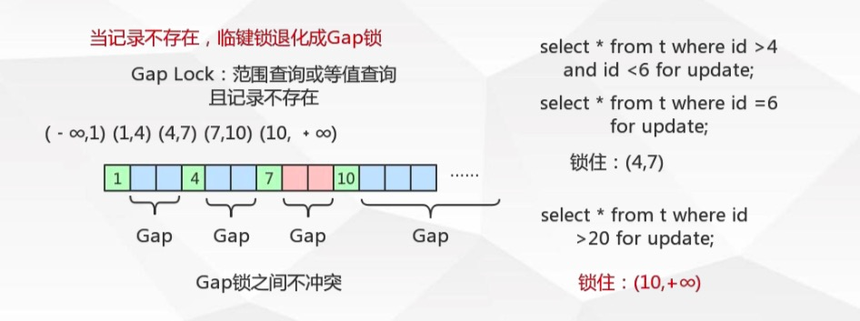
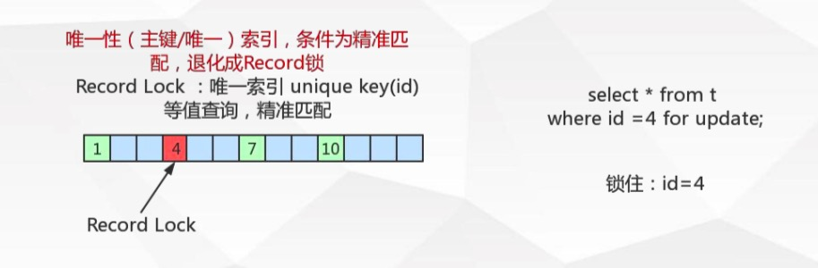
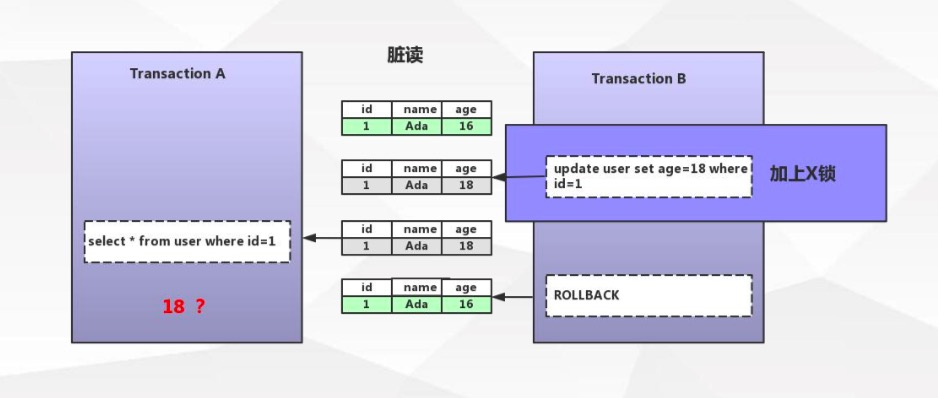
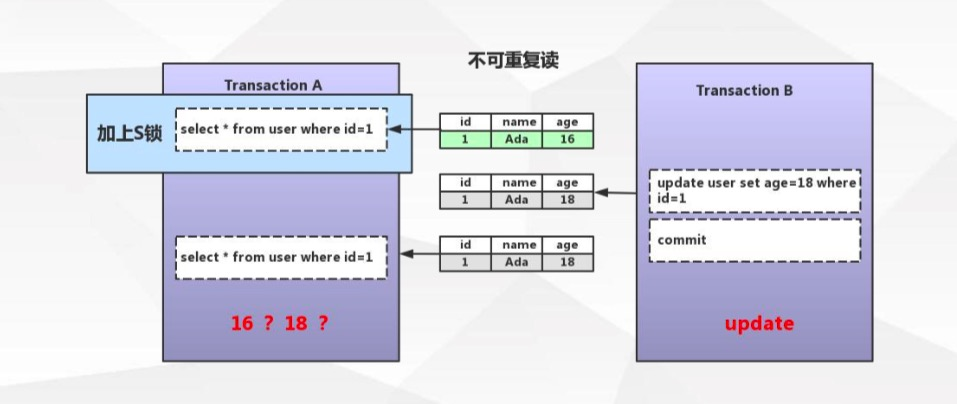
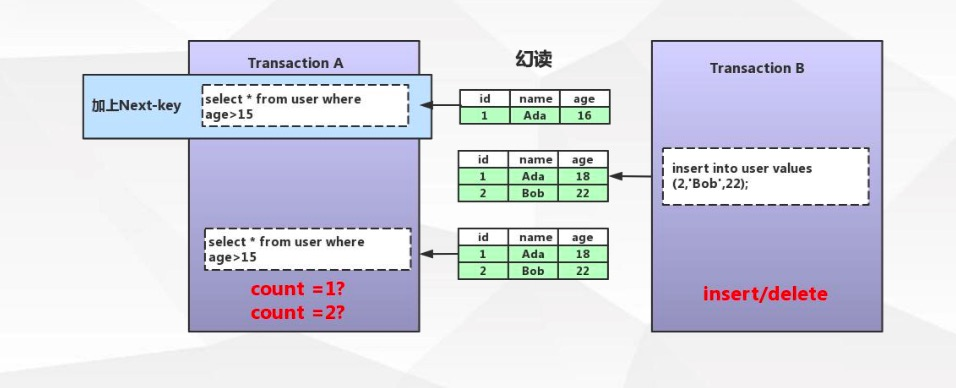

[TOC]

# 表锁和行锁

锁是用于管理不同事务对共享资源的并发访问

表锁与行锁的区别: 

- 锁定粒度：表锁 > 行锁
- 加锁效率：表锁 > 行锁
- 冲突概率：表锁 > 行锁
- 并发性能：表锁 < 行锁

InnoDB 存储引擎支持行锁和表锁（表锁是通过行锁实现的）

# InnoDB 锁类型

锁类型：

- 共享锁（行锁）：Shared Locks
- 排它锁（行锁）：Exclusive Locks
- 意向共享锁（表锁）：IntentionShared Locks 
- 意向排它锁（表锁）：Intention Exclusive Locks
- 自增锁：AUTO-INC Locks

行锁的算法：

- 记录锁 Record Locks
- 间隙锁 Gap Locks
- 临键锁 Next-key Locks 

## 共享锁与排他锁

### 共享锁

又称为读锁，简称 `S锁` ，顾名思义，共享锁就是多个事务对于同一数据可以共享一把锁，都能访问到数据，但是只能读不能修改

加锁释锁方式：

```
select * from users WHERE id=1 LOCK IN SHARE MODE; 
commit/rollback;
```

举个例子：

```
### session1 ###
begin;
select * from sys_user where id=1 lock in share mode;	# 获取S锁
commit;

### session2 ###
select * from sys_user where id=1;			# 可以正常执行
update sys_user set name='k2' where id=1;	# 当上面没有commit，该语句将被阻塞
```

### 排他锁

又称为写锁，简称 `X锁` ，排他锁不能与其他锁并存，如一个事务获取了一个数据行的排他锁，其他事务就不能再获取该行的锁（共享锁、排他锁），只有该获取了排他锁的事务是可以对数据行进行读取和修改，（其他事务要读取数据可来自于快照）

加锁释锁方式：

```
delete / update / insert 默认加上X锁
SELECT * FROM table_name WHERE ... FOR UPDATE;
commit/rollback;
```

例子：

```
### session1 ###
begin;
update sys_user set name='k3' where id=1;	# 自动获取X锁
commit;

### session2 ###
select * from sys_user where id=1 for update;			# 等待上面commit
select * from sys_user where id=1 lock in share mode;	# 等待上面commit
select * from sys_user where id=1;						# 没影响
```

### 那么 InnoDB 行锁到底锁了什么？

InnoDB的行锁是通过给索引上的索引项加锁来实现的

**只有通过索引条件进行数据检索，InnoDB才使用行级锁，否则，InnoDB 将使用表锁（锁住索引的所有记录）**

所以在执行 delete / update / insert 时，也需要考虑索引，因为没有命中索引会变成表锁

表锁：

```
lock tables xx read/write; 
```

## 意向共享锁与意向排它锁

- 意向共享锁（IS）

  表示事务准备给数据行加入共享锁，即一个数据行加共享锁前必须先取得该表的IS锁

- 意向排它锁（IX） 

  表示事务准备给数据行加入排他锁，即一个数据行加排他锁前必须先取得该表的IX锁

简单来说，这两种锁就是一个标志位，在拿锁之前，先要判断IS/IX

意向锁（IS、IX）是 InnoDB 数据操作之前自动加的，不需要用户干预 

当事务想去进行锁表时，可以先判断意向锁是否存在，存在时则可快速返回该表不能启用表锁 

## 自增锁

针对自增列自增长的一个特殊的表级别锁

```
show variables like 'innodb_autoinc_lock_mode'; 
```

默认取值1，代表连续，事务未提交ID永久丢失

## 记录锁、间隙锁、临键锁

### 临键锁（Next-Key）

临键锁是 InnoDB 默认的行锁算法

当sql执行按照索引进行数据的检索时，查询条件为范围查找（between and、<、>等）并有数据命中，则此时sql语句加上的锁为 Next-Key locks，锁住索引的记录 + 区间（左开右闭）

例子：

当数据库里与 id 为1、4、7、10四条数据，那么：



它可以有效的方式幻读

### 间隙锁（Gap）

当sql执行按照索引进行数据的检索时，查询条件的数据不存在，这时sql语句加上的锁即为Gap locks，锁住索引不存在的区间（左开右开）



Gap locks只在RR事务隔离级别存在

### 记录锁（Record）

当sql执行按照唯一性（Primary key、Unique key）索引进行数据的检索时，查询条件等值匹配且查询的数据时存在，这时sql语句加上的锁为记录锁，锁住具体的索引项



# 锁是如何解决事务并发

## 解决脏读



## 解决不可重复读



## 解决幻读



# 死锁

当2个或以上事务都在等待对方释放锁，产生循环等待，即形成了死锁

如何解决：

1. 类似的业务逻辑以固定的顺序访问表和行
2. 大事务拆小（大事务更倾向于死锁）
3. 在同一个事务中，尽可能做到一次锁定所需要的所有资源
4. 如果业务允许，可以降低事务隔离级别
5. 为表添加合适的索引（如果不走索引将会为表的每一行记录添加上锁，产生表锁）