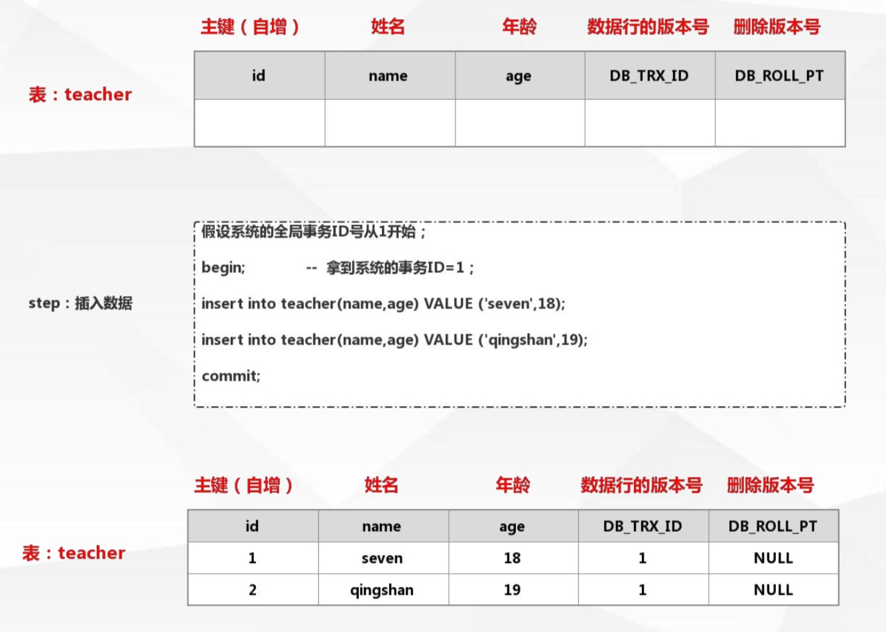
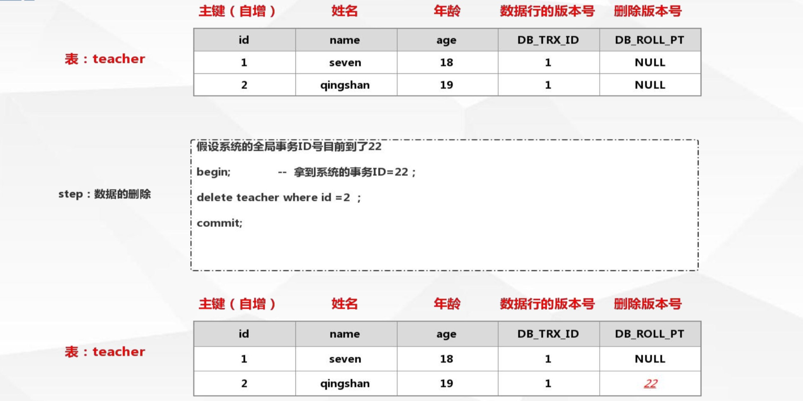
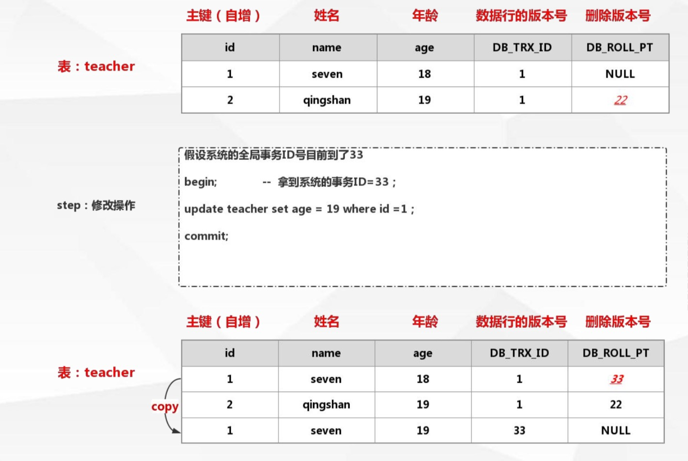
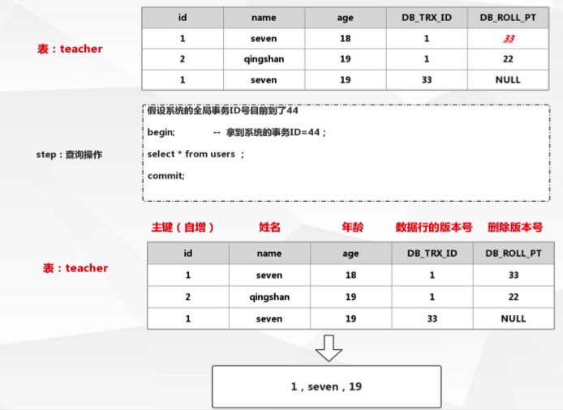
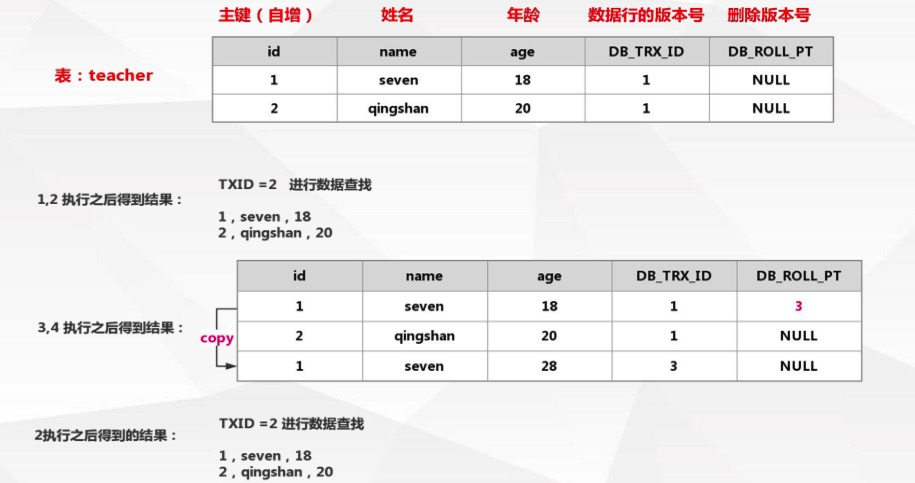
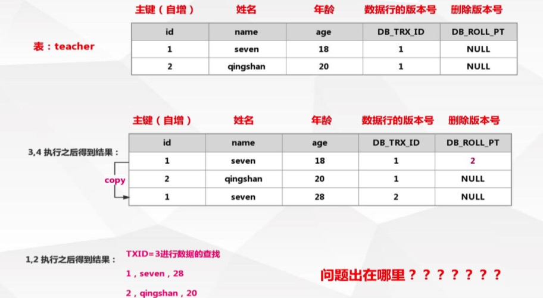
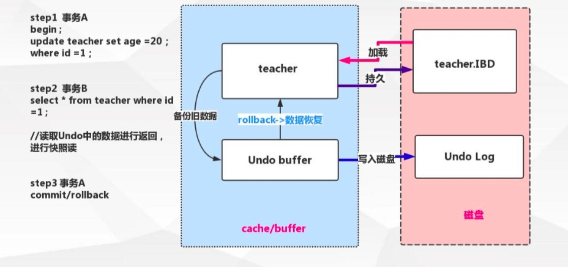
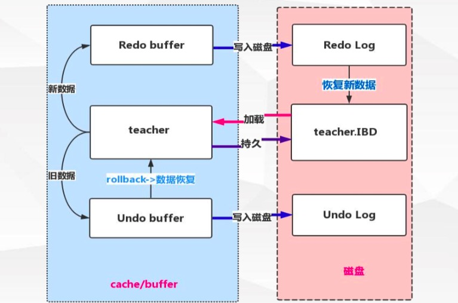

[TOC]

MVCC：Multiversion concurrency control （多版本并发控制）

并发访问（读或写）数据库时，对正在事务内处理的数据做多版本的管理。以达到用来避免写操作的堵塞，从而引发读操作的并发问题。

# Mysql中MVCC逻辑流程

在我们的 mysql 表中，都会有个默认列：

* DB_TRX_ID：数据行的版本号
* DB_ROLL_PT：删除版本号

这些版本号就是事务ID

## 插入



在数据行版本号中，加入当前的事务ID

## 删除



在删除版本号中，加入当前的事务ID

这里需要注意的是，虽然数据删除了，但是 mysql 中还是有记录的

## 修改



修改操作是先做命中的数据行的copy，将原行数据的删除版本号的值设置为当前的事务ID

## 查询



规则：

1. 查询数据行版本早于当前事务版本的数据行

   > 行的版本号小于或等于事务ID，这样可以确保事务读取的行，要么是在事务开始前已经存在的，要么是事务自身插入或者修改过的

2. 查找删除版本号为NULL或者大于当前事务版本号的记录

   > 确保取出来的行记录在事务开启之前没有被删除

# Mysql中MVCC版本控制案例

数据准备：

```
insert into teacher(name,age) value ('seven',18); 
insert into teacher(name,age) value ('qing',20);
```

执行语句：

```
##### tx1 #####
begin;													-- 1
select * from users ;									-- 2
commit;

##### tx2 #####
begin;													-- 3
update teacher set age =28 where id =1;					-- 4
commit;
```

## 案例一

上面的执行语句顺序：1，2，3，4，2



按照MVCC的流程，当update语句还没有提交之前，再去select查询时，还是读到的是之前的数据，符合预期

## 案例二

上看的执行语句顺序：3，4，1，2



这次是先update，然后在select，这里都没有做commit操作，按照MVCC的流程，select读取到了update没有提交的数据，为什么会这样？

如果按照MVCC流程会有这个问题，但是，在执行update时，会上X锁，这时候select会去做快照读，看下面的分析

# Undo log

* 实现事务的原子性

  事务处理过程中如果出现了错误或者用户执行了 ROLLBACK 语句，Mysql可以利用Undo Log中的备份将数据恢复到事务开始之前的状态

* 在 InnoDB 中用来实现多版本并发控制

  事务未提交之前，Undo保存了未提交之前的版本数据，Undo 中的数据可作为数据旧版本快照供其他并发事务进行快照读 



快照读：

> SQL读取的数据是快照版本，也就是历史版本，普通的SELECT就是快照读
>
> InnoDB快照读，数据的读取将由 cache（事务修改过的数据） + undo（原本数据） 两部分组成

当前读：

>SQL读取的数据是最新版本
>
>通过锁机制来保证读取的数据无法通过其他事务进行修改 UPDATE、DELETE、INSERT、SELECT ... LOCK IN SHARE MODE、SELECT ... FOR UPDATE都是当前读 

# Redo log

redo log是为了实现事务的持久性

防止在发生故障的时间点，尚有脏页未写入磁盘，在重启mysql服务的时候，根据redo log进行重做，从而达到事务的未入磁盘数据进行持久化这一特性



指定redo log记录在 `{datadir}/ib_logfile1&ib_logfile2` 可通过 `innodb_log_group_home_dir` 配置指定 目录存储 

一旦事务成功提交且数据持久化落盘之后，此时redo log中的对应事务数据记录就失去了意义，所以redo log的写入是日志文件循环写入的 

* 指定redo log日志文件组中的数量 `innodb_log_files_in_group` 默认为2 
* 指定redo log每一个日志文件最大存储量 `innodb_log_file_size` 默认48M 
* 指定redo log在 cache/buffer 中的 buffer 池大小 `innodb_log_buffer_size` 默认16M 

Redo buffer 持久化Redo log的策略， `Innodb_flush_log_at_trx_commit` :

* 取值 0 每秒提交 **Redo buffer -> Redo log OS cache -> flush cache to disk**（可能丢失一秒内的事务数据）
* 取值 1 每次事务提交执行 **Redo buffer -> Redo log OS cache -> flush cache to disk**（默认值，最安全，性能最差的方式）
* 取值 2 每次事务提交执行 **Redo buffer -> Redo log OS cache 再每一秒执行 -> flush cache to disk** 